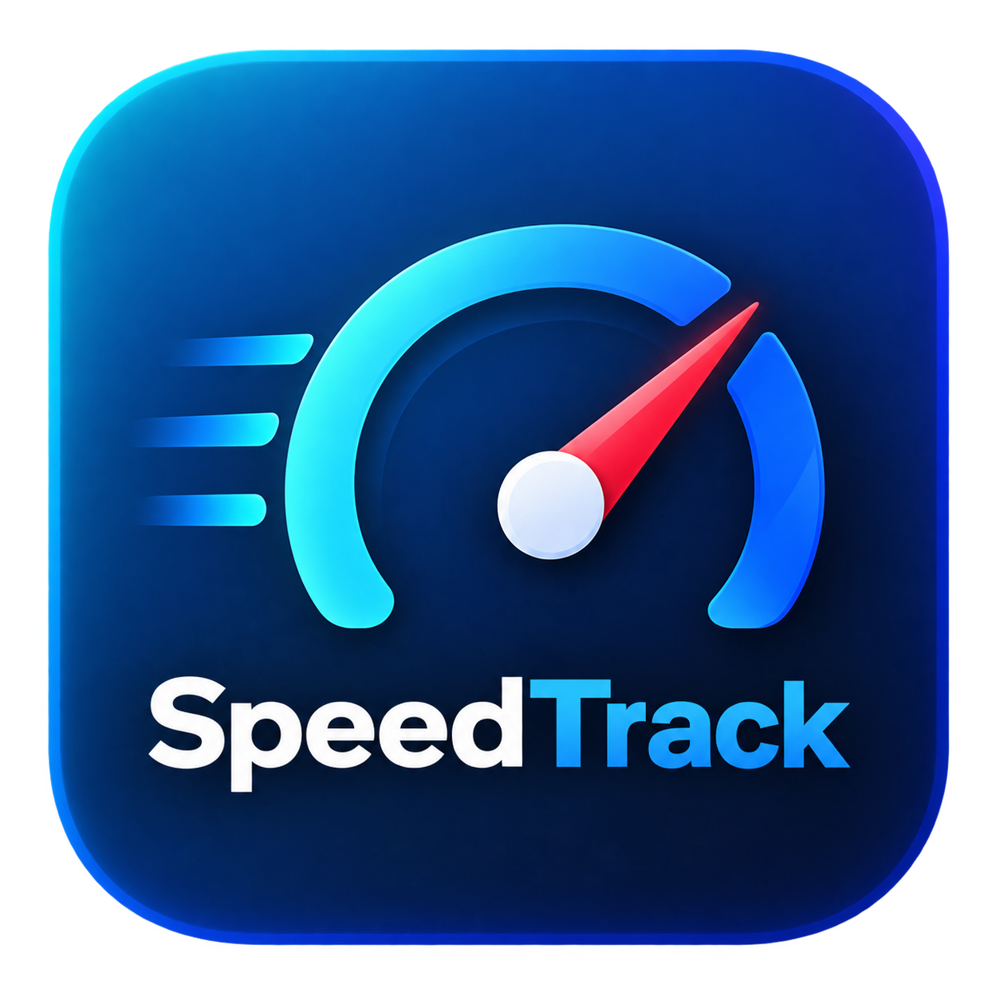

<div align="center">
  

  # SpeedTrack

  ### Drive Safe, Go Further

  A modern Flutter speedometer app concept with a glowing dashboard, trip tracking, safety alerts, distance goals, cruise mode, and saved driving records.

  
  
  
</div>

---

## Overview

**SpeedTrack** is a mobile speedometer dashboard built with Flutter. It is designed with a polished dark-blue driving interface, animated gauge visuals, safety-focused feedback, and practical trip tools for tracking simulated driving performance.

The app currently uses a simulated speed controller, making it perfect for UI demos, Flutter learning, and future expansion into GPS-based real speed tracking.

---

## Features

### Dashboard

- Modern dark SpeedTrack UI
- Large glowing speedometer gauge
- Animated speed needle
- Live speed display
- KM/H and MPH unit switching
- Brake and accelerator controls
- Cruise Control mode
- Safety status banner
- Safety score percentage
- Over-limit event tracking

### Trip Tracking

- Current trip distance
- Trip duration timer
- Average speed
- Maximum speed
- Distance goal progress
- Save trip records
- Reset current trip

### Records

- Saved trip history
- Best distance summary
- Saved trip date
- Average speed per saved trip
- Max speed per saved trip
- Safety score per saved trip
- Over-limit event count per saved trip
- Delete individual records
- Clear all records

### Settings

- Change speed unit
- Adjust speed limit
- Set distance goal
- Enable or disable safety alerts
- Enable or disable Eco Mode
- Enable or disable Cruise Control

### Splash Screen

- Branded SpeedTrack launch screen
- Glowing speed gauge logo animation
- Loading indicator
- Safety-first footer

---

## Screens

| Screen | Purpose |
| --- | --- |
| Home | Main speedometer dashboard and driving controls |
| Trips | Current trip summary, distance goal, and save/reset actions |
| Records | Saved trip history and best trip details |
| Settings | User preferences for limits, goals, units, and driving modes |

---

## Tech Stack

- **Flutter** for cross-platform UI
- **Dart** for app logic
- **CustomPainter** for the speedometer gauge
- **Material 3** styling
- **Android target SDK 36** for Google Play compliance

---

## Project Structure

```text
lib/
  core/
    speed_formatters.dart
    speed_unit.dart
  models/
    trip_record.dart
  screens/
    speedometer_screen.dart
  views/
    home_view.dart
    records_view.dart
    settings_view.dart
    tab_scaffold.dart
    trips_view.dart
  widgets/
    bottom_navigation.dart
    drive_button.dart
    glass_panel.dart
    speedtrack_cards.dart
    speedtrack_header.dart
    unit_switch.dart
  main.dart
  meter_painter.dart
  splash_screen.dart
  speedometer.dart
```

---

## Getting Started

### Requirements

- Flutter SDK
- Dart SDK
- Android Studio or VS Code
- Android SDK Platform 36

### Install Dependencies

```bash
flutter pub get
```

### Run the App

```bash
flutter run
```

### Run Tests

```bash
flutter test
```

### Analyze Code

```bash
flutter analyze
```

### Build Debug APK

```bash
flutter build apk --debug
```

### Build Release App Bundle

```bash
flutter build appbundle --release
```

The release `.aab` file is usually generated at:

```text
build/app/outputs/bundle/release/app-release.aab
```

---

## Android Release Notes

This project has been updated for Google Play target API requirements:

- `compileSdk 36`
- `targetSdkVersion 36`
- Android Gradle Plugin `8.9.1`
- Gradle wrapper `8.12`
- Kotlin plugin `2.1.0`

---

## Future Improvements

- Real GPS speed tracking
- Location permission flow
- Trip route map
- Persistent local storage for records
- Export trip history
- Dark/light theme toggle
- Speed alert sound or vibration
- App launcher icon update using the SpeedTrack logo

---

## App Identity

**Name:** SpeedTrack  
**Tagline:** Drive Safe, Go Further  
**Category:** Speedometer, Trip Tracker, Driving Safety

---

<div align="center">

Built with Flutter.

Keep your speed steady. Keep your journey smarter.

</div>
